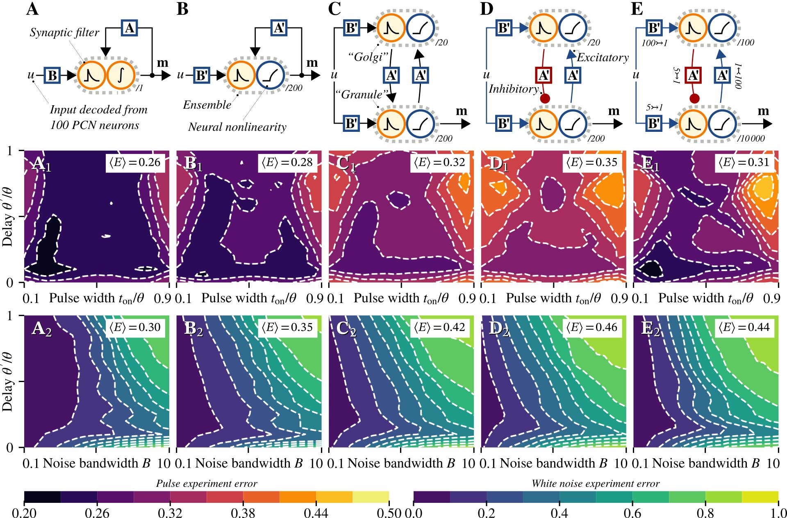

# Connecting Biological Detail with Neural Computation: Application to the Cerebellar Granule-Golgi Microcircuit

*Andreas Stöckel, Terry Stewart, Chris Eliasmith*

The repository contains the code used to produce the data shown in the paper Topics in Cognitive Science (TopiCS) paper "Connecting Biological Detail with Neural Computation: Application to the Cerebellar Granule-Golgi Microcircuit" (to appear later this year).



## Running the code

The code to execute and visualise the experiments can be found in the `notebooks` folder, the model itself is located in the `model` folder.
We recommend that you use the provided Docker file to build a Docker container that can run the code.


### Using the Pre-Built Docker Container

To reproduce the results from the paper you can use the provided Docker container to enter a reproducible environment.

*Prerequisite*  
Install Docker or a compatible container manager such as Podman on your system. Please follow the documentation on the Docker homepage our your operating system manual.

*Step 1:*  
Download the file `topics2021_cerebellum_docker_astoeckel_tcstewart_celiasmith.tar.bz2` from OSF.

*Step 2:*  
Place the downloaded file in a new directory. Open a command prompt and `cd` into this directory. Then, execute the following.
```sh
# Import the docker container
docker import topics2021_cerebellum_astoeckel_tcstewart_celiasmith.tar.bz2 cerebellum

# Create a `data` directory; this is where the generated files will be stored.
mkdir data

# Execute the docker container.
docker run -p 4567:4567 -v "$PWD/data:/topics2021-cerebellum/notebooks/out:z" -it cerebellum /topics2021-cerebellum/run.sh
```
This will start a Jupyter lab instance inside the docker container; open the displayed URL (e.g., `http://127.0.0.1:4567/lab?token=...`) in your browser.
Files stored in the `notebooks/out` folder inside the container will appear in the `data` folder outside the container.
All other changes to the filesystem are not persistent.


### Building the Docker container from scratch

Download the file `topics2021_cerebellum_source_astoeckel_tcstewart_celiasmith.tar.bz2` from OSF, or, alternatively, clone this GitHub repository.

Unpack the archive and open a command prompt inside the root directory of the archive. Then run the following commands.
```
# Step 1: Build the docker container
docker import topics2021_cerebellum_astoeckel_tcstewart_celiasmith.tar.bz2 cerebellum

# Step 2: Execute the docker container.
docker run -p 4567:4567 -v "$PWD/data:/topics2021-cerebellum/notebooks/out:z" -it cerebellum
```


### Running the experiments

Open the Jupyter notebook instance and navigate to the `notebooks` folder.
Execute all notebooks in order. Depending on your machine, this will take a quite a few hours.

The results will be placed in the `data` directory.

## Bibliography entry

The article will appear later this year (2021) in the "Best of ICCM" special issue.

## License

Copyright (C) 2019-2021  Andreas Stöckel, Terry Stewart

This program is free software: you can redistribute it and/or modify
it under the terms of the GNU General Public License as published by
the Free Software Foundation, either version 3 of the License, or
(at your option) any later version.

This program is distributed in the hope that it will be useful,
but WITHOUT ANY WARRANTY; without even the implied warranty of
MERCHANTABILITY or FITNESS FOR A PARTICULAR PURPOSE.  See the
GNU General Public License for more details.

You should have received a copy of the GNU General Public License
along with this program.  If not, see <https://www.gnu.org/licenses/>.
